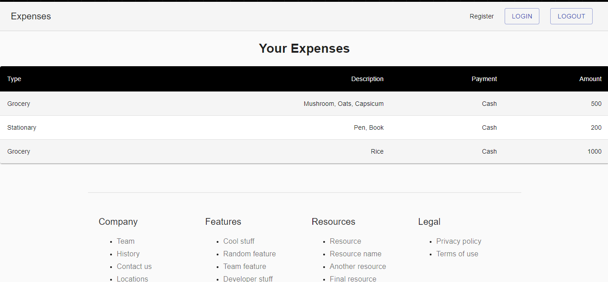
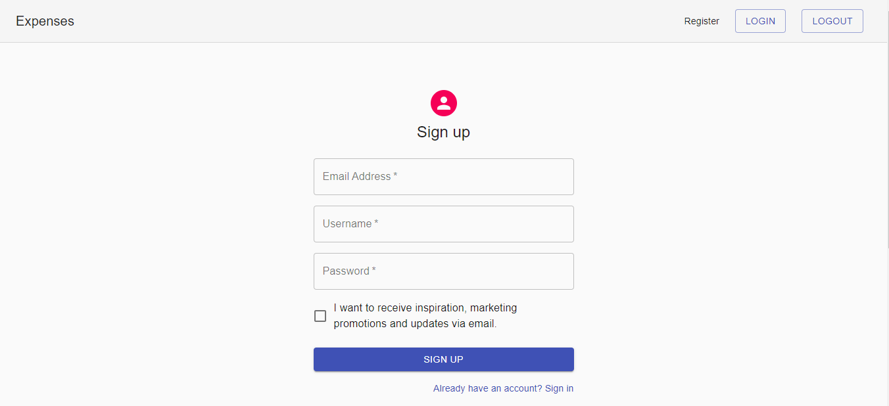
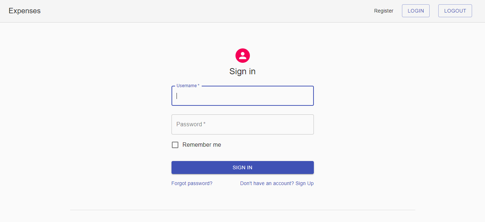

# Expense Tracker

A functional expense tracker project implemented with Django REST Framework, React, MaterialUI.

## Features

- User login,logout, registration
- Login authentication
- Token based authentication

## Quick Glance

## Contributing

Feel free to fix bugs, improve things, provide documentation. Just send a pull request.
